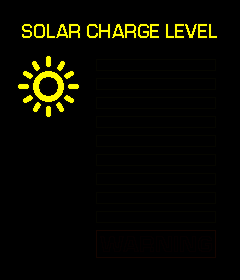
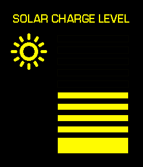
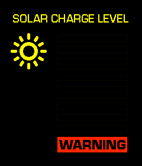

## List of components

* ESP8266
* 1.69" Color TFT Display 240X280 SPI ST7789 ([link](https://s.click.aliexpress.com/e/_EySYptH ))
* 1 x 47kΩ resistor
* 1 x 51kΩ resistor
* 1 x 100kΩ resistor 

## Schematic

NodeMCU -> Display

* GND > GND
* 3V3 > VCC
* D5 > SCL
* D7 > SDA
* D0 > RES
* D1 > DC
* D2 > CS
* 3V3 > BLK (this powers the backlight on this particular display unit, I might add brighness level later) 

## Animations

### Startup

The Solar Panel starts up like it does in the movie when it charges. The battery level bars come on from 0% to 100% in different speeds based on the actual beeps in the movie.

### Battery level

The Solar Panel shows the battery percentage (set for 3S lipo between 10.8V (safe minimum voltage) to 12.6V (fully charged). Every bar represents 10 percent of the charge.

### Low battery warning

The Solar Panel shows the "WARNING" text in the red lower bar while it's blinking. The blinking speed is based on the actual speed in the movie.

